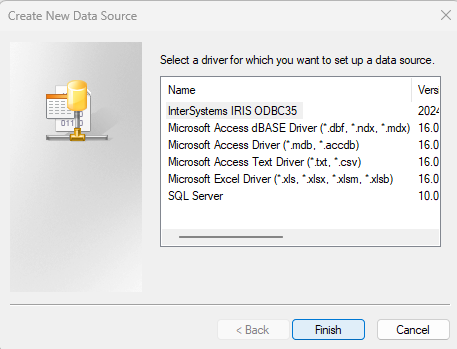
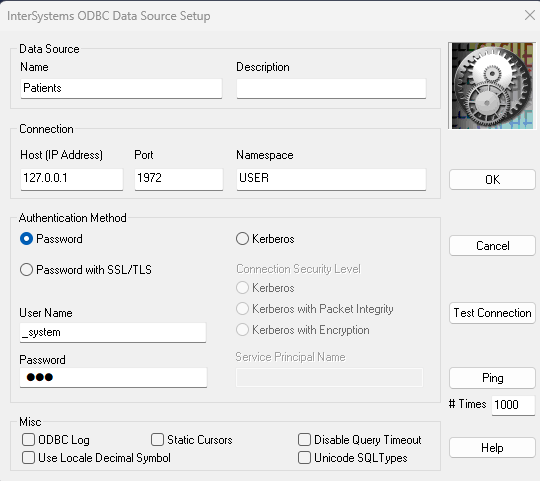

# Test 01
## Namespace
- ### Package:
	- This production will be in the pIRIS namespace and will be called: test01.
- ### Production:
	- This production will be in the test01 package and will be called: PatientInfo.
### 
## Variables
- PatientID %Integer
- FirstName %String
- MiddleName %String
- LastName %String
- Age %Integer
- Allergies %String
- OverAge %Boolean
## Messages
- ### ProcessRequest
    ```
    Class code.msg.ProcessRequest Extends Ens.Request
    {

    Property PatientID As %Integer;

    }
    ```
- ### PatientDBRequest
    ```
    Class code.msg.PatientDBRequest Extends Ens.Request
    {

    Property PatientID As %Integer;

    }
    ```
- ### PatientDBResponse
    ```
    Class code.msg.PatientDBResponse Extends Ens.Response
    {

    Property FirstName As %String;

    Property MiddleName As %String;

    Property LastName As %String;

    Property Age As %Integer;

    Property Allergies As %String;

    Property OverAge As %Boolean;

    }
    ```
- ### MakeFileRequest
    ```
    Class code.msg.MakeFileRequest Extends Ens.Request
    {

    Property PatientID As %Integer;

    Property FirstName As %String;

    Property MiddleName As %String;

    Property LastName As %String;

    Property Age As %Integer;

    Property Allergies As %String;

    }
    ```
## Buisness Services
- ### PatientIDService
## Buisness Processes
- ### PatientInfoProcess
## Buisness Operations
- ### PatientDBOperation
    ```
    Class code.bo.PatientDBOperation Extends Ens.BusinessOperation
    {

    Parameter ADAPTER = "EnsLib.SQL.OutboundAdapter";

    Parameter INVOCATION = "Queue";

    Method PatientInfo(pRequest As code.msg.PatientDBRequest, Output pResponse As code.msg.PatientDBResponse)
    {
        set pResponse=##class(code.msg.PatientDBResponse).%New()
        
        set query = "Select FirstName, MiddleName, LastName, Age, Allergies from SQLUser.Patients where PatientID = "_pRequest.PatientID
        set st =..Adapter.ExecuteQuery(.tResult,query)
        $$$TRACE("st = "_st) 
        do tResult.Next()

        set pResponse.FirstName=tResult.Get("FirstName")    
        set pResponse.MiddleName=tResult.Get("MiddleName")
        set pResponse.LastName=tResult.Get("LastName")
        set pResponse.Age=tResult.Get("Age")
        set pResponse.Allergies=tResult.Get("Allergies")
        set pResponse.OverAge=0
        if (pResponse.Age >= 18) {
            set pResponse.OverAge=1
        }

        Quit $$$OK
    }

    XData MessageMap
    {
    <MapItems>
            <MapItem MessageType="code.msg.PatientDBRequest">
                <Method>PatientInfo</Method>
            </MapItem>
        </MapItems>
    }

    }

    ```
- ### MakeFileOperation
## Data Base
- ### SQL Table: Patients
    ```
    CREATE TABLE Patients (
        PatientID INT PRIMARY KEY,
        FirstName VARCHAR(150),
        MiddleName VARCHAR(150),
        LastName VARCHAR(150),
        Age INT,
        Allergies VARCHAR(150)
    )
    ```
- ### SQL Rows
    ```
    INSERT INTO Patients (PatientID, FirstName, MiddleName, LastName, Age, Allergies) 
    VALUES (1, 'Mrtin', 'L.' , 'Gore', 63, 'None');
    ```
- ### DSN
	- Open ODBC 64 bits
	- Under "System DSN" click "Add..."
	- 
	- Select the "InterSystems IRIS" then click "Finish"
	- 
	- Now fill the server info with the following details then click "Ok".
	- 