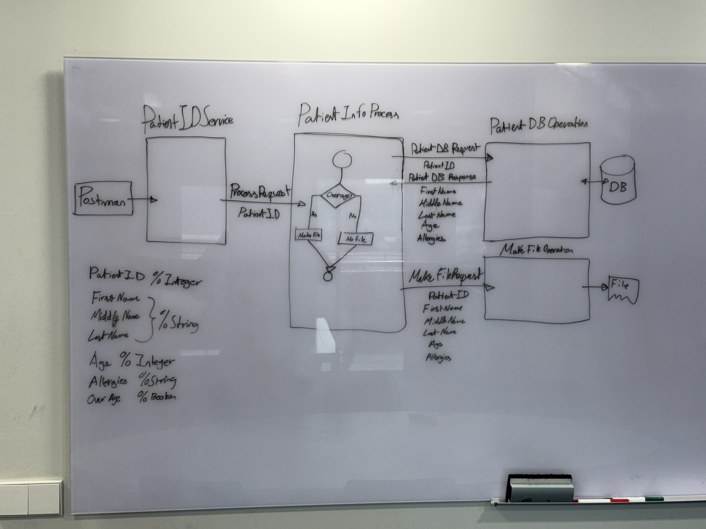

# Test 01
## Namespace
- This Production will be in the pIRIS namespace.
### 
## Variables
- PatientID %Integer
- FirstName %String
- MiddleName %String
- LastName %String
- Age %Integer
- Allergies %String
- OverAge %Boolean
## Messages
- ### ProcessRequest
    ```
    Class test.msg.ProcessRequest Extends Ens.Request
    {

    Property PatientID As %Integer;

    }
    ```
- ### PatientDBRequest
    ```
    Class test.msg.PatientDBRequest Extends Ens.Request
    {

    Property PatientID As %Integer;

    }
    ```
- ### PatientDbResponse
    ```
    Class test.msg.PatientDBResponse Extends Ens.Response
    {

    Property FirstName As %String;

    Property MiddleName As %String;

    Property LastName As %String;

    Property Age As %Integer;

    Property Allergies As %String;

    Property OverAge As %Boolean;

    }
    ```
- ### MakeFileRequest
    ```
    Class test.msg.MakeFileRequest Extends Ens.Request
    {

    Property PatientID As %Integer;

    Property FirstName As %String;

    Property MiddleName As %String;

    Property LastName As %String;

    Property Age As %Integer;

    Property Allergies As %String;

    }
    ```
## Buisness Services
- ### PatientIDService
## Buisness Processes
- ### PatientInfoProcess
## Buisness Operations
- ### PatientDBOperation
    ```
    Class test.bo.PatientDBOperation Extends Ens.BusinessOperation
    {

    Parameter ADAPTER = "EnsLib.SQL.OutboundAdapter";

    Parameter INVOCATION = "Queue";

    Method PatientInfo(pRequest As test.msg.PatientDBRequest, Output pResponse As test.msg.PatientDBResponse)
    {
        set pResponse=##class(test.msg.PatientDBResponse).%New()
        
        set query = "Select FirstName, MiddleName, LastName, Age, Allergies from SQLUser.pts where PatientID = "_pRequest.PatientID
        set st =..Adapter.ExecuteQuery(.tResult,query)
        $$$TRACE("st = "_st) 
        do tResult.Next()

        set pResponse.FirstName=tResult.Get("FirstName")    
        set pResponse.MiddleName=tResult.Get("MiddleName")
        set pResponse.LastName=tResult.Get("LastName")
        set pResponse.Age=tResult.Get("Age")
        set pResponse.Allergies=tResult.Get("Allergies")
        set pResponse.OverAge=0
        if (pResponse.Age >= 18) {
            set pResponse.OverAge=1
        }

        Quit $$$OK
    }

    XData MessageMap
    {
    <MapItems>
            <MapItem MessageType="test.msg.PatientDBRequest">
                <Method>PatientInfo</Method>
            </MapItem>
        </MapItems>
    }

    }
    ```
- ### MakeFileOperation
## 